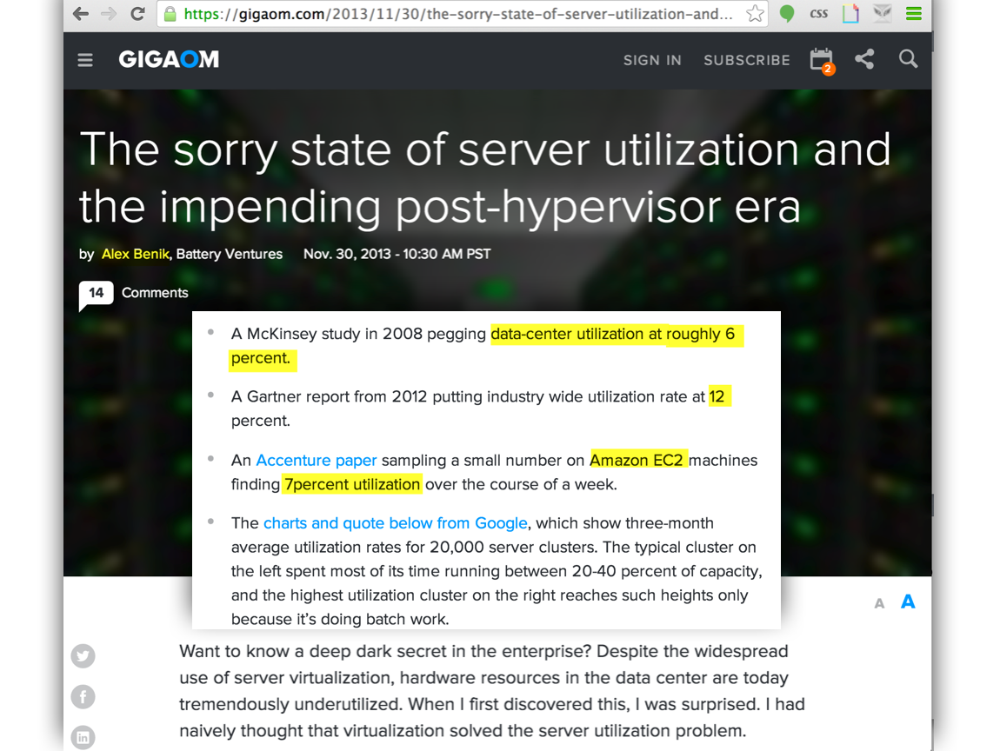
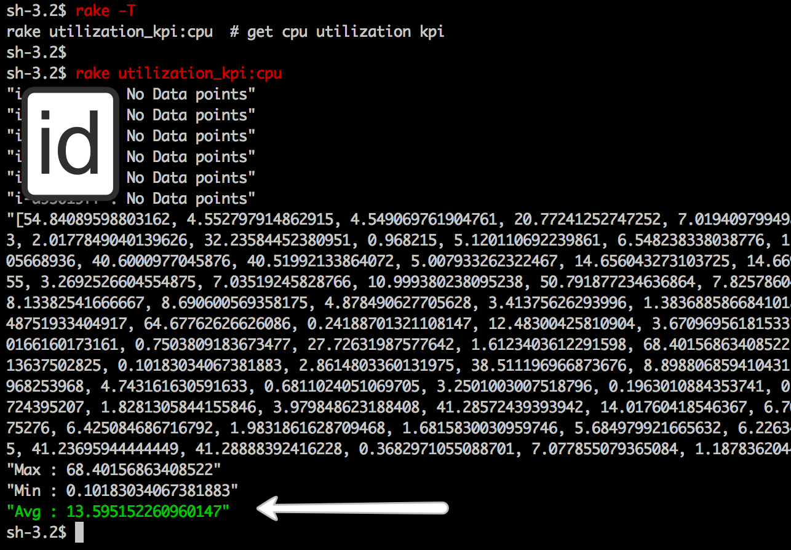

UtilizationIndicator
===================

  UtilizationIndicator is  set of tasks for automating the retrieval of KPIs for Data Center Utilization. It currently supports AWS cpu utilization (using cloudwatch api)

Why?
----
  Alex Benik revealed in an [article](https://gigaom.com/2013/11/30/the-sorry-state-of-server-utilization-and-the-impending-post-hypervisor-era/) about the state of data center utilization and the fact that people don't report this as a infratructure KPI.

How?
---
  Just add aws credential keys to .env file and look up the tasks with "rake -T"

 

---

 Copyright (c) 2015 [Abhishek Parolkar] abhishek[at]parolkar.com , released under the MIT license 

